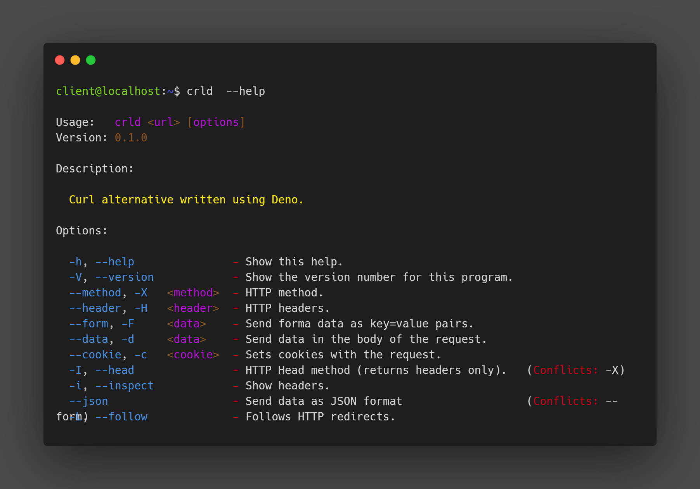
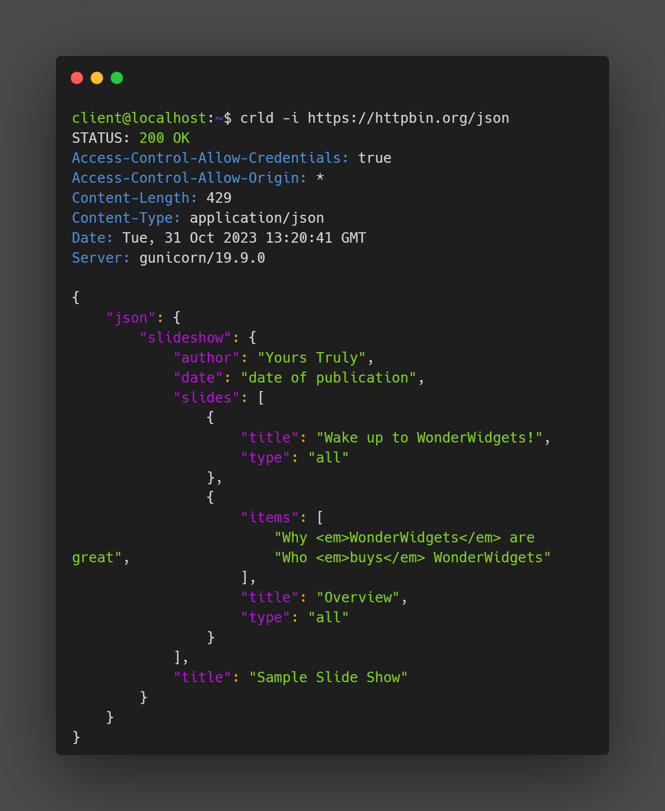
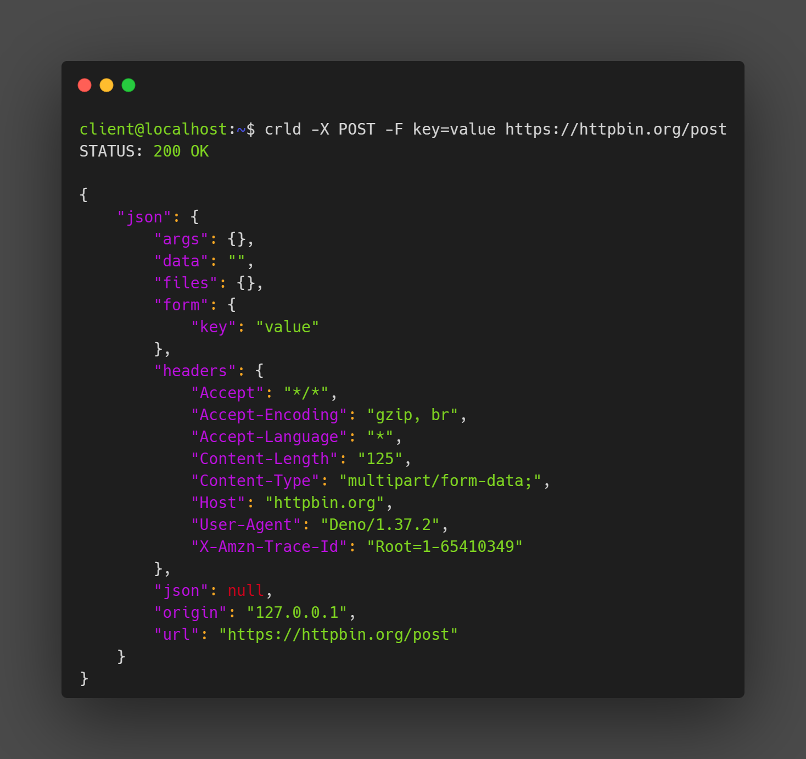

<h1 style="color:lime; font-weight: bold; font-size:40px">CRLD</h1>



A simple [curl](https://curl.se/) alternative written using [Deno](https://deno.com/). It just wraps `fetch` with the selected options and pretty prints the response.

## Features:

- JSON highliter
- support json/form data
- inspecting headers
- cookies

## Examples:

```bash
# Inspecting headers for a json response
crld -i https://httpbin.org/json
```



```bash
# Sending form data
crld -i https://httpbin.org/json
```



## Installing:

Head over the release tab and choose a fitting binary or clone this repository and run/compile the project with the --allow-net flag.

## Future developements:

- sending files with requests
- gruping request in collections (Deno KV)
- saving credentials between requests(runafter :requestId)

## See also:

- [curlx](https://github.com/shivkanthb/curlx) - JavaScript wrapper for the curl command
- [httpie](https://httpie.io/) - API testing software with web, desktop and CLI versions
